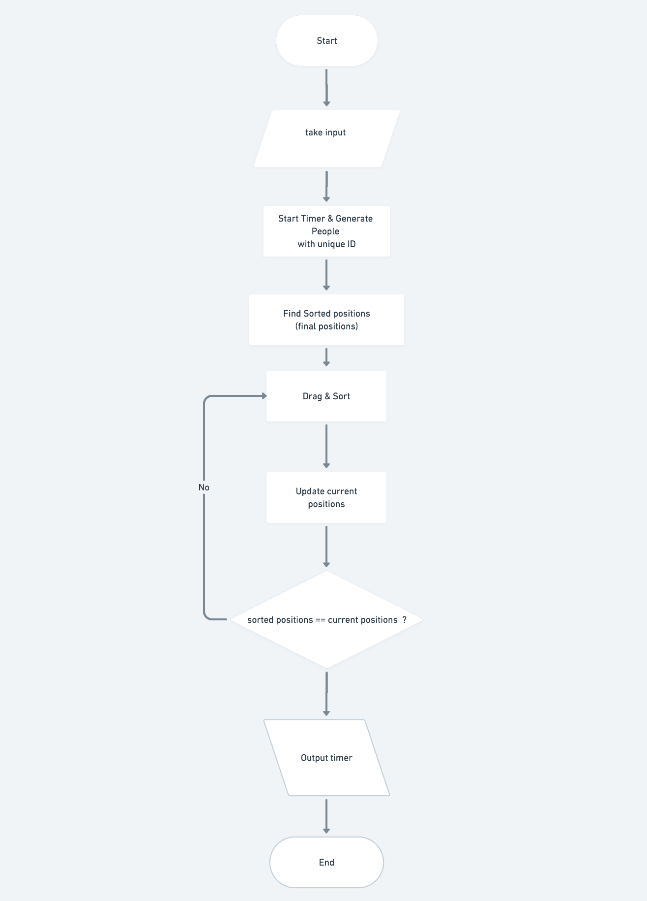

# Sorting Training System


## Project setup
```
yarn install
```

## Compiles and hot-reloads for development
```
yarn serve
```

## Compiles and minifies for production
```
yarn build
```

## Lints and fixes files
```
yarn lint
```


## Algorithm
 1.  Take input
 2.  Start timer
 3.  Generate people with unique id
 4.  Create a list of sorted positions (the final position for all)
 5.  Drag & drop and update current positions
 6.  Compare current positions with the sorted positions
 7.  If current postions and sorted positions are same stop the timer & show score
 8.  otherwise go to step 5


## Flowchart

